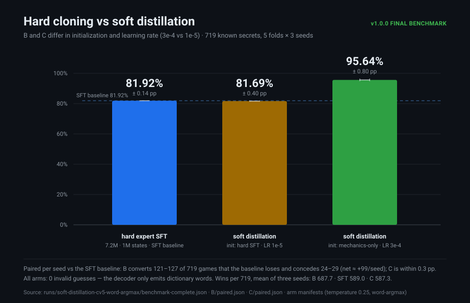
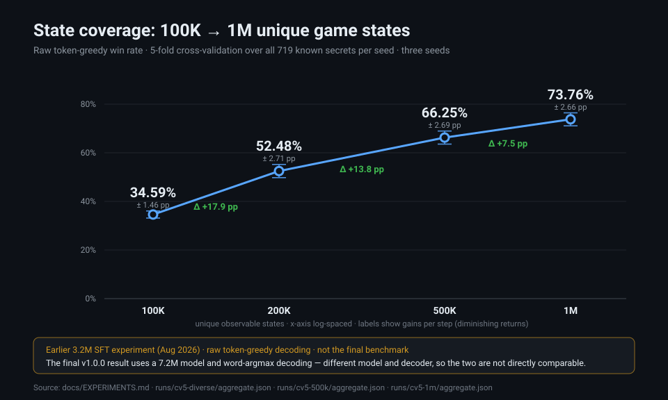
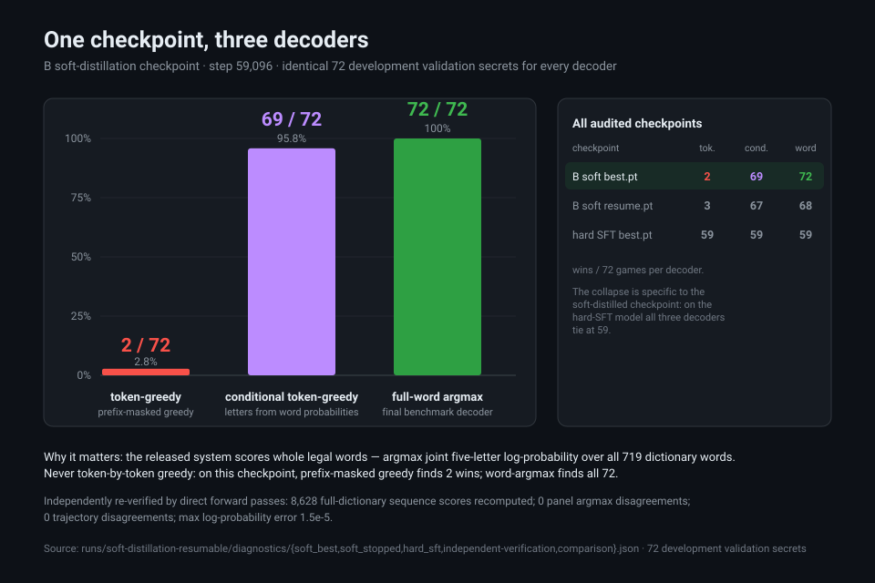

# Wordle GPT

**Can a 7.2M-parameter decoder-only Transformer learn to play Wordle — the rules *and* the strategy — from nothing but game trajectories serialized as text?**

No solver and no search select its guesses: the neural policy reads observed guesses and feedback and scores complete legal words to choose each next move. (The demo wraps it in a small game loop whose engine only supplies real feedback.) This repository is the completed, frozen research artifact for **v1.0.0** — original training code, dated experiment logs (including the failures), cross-validation artifacts, a released CPU checkpoint bundle, and a runnable demo. See [RELEASE.md](docs/RELEASE.md) for the version record and [Scope and limitations](#scope-and-limitations) for exactly what these numbers do and do not claim.

## The final result

The released model is arm **B**: soft policy distillation from a classical solver into a mechanics-pretrained 7.2M Transformer.

| Arm | Initialization | Win rate (mean ± SD) | Wins / 719 | Avg guesses on wins |
| :--- | :--- | ---: | ---: | ---: |
| **B — soft distillation** | mechanics-only 7.2M model | **95.64% ± 0.80 pp** | **687.7** | 3.85 |
| hard SFT | mechanics-only 7.2M model, expert imitation | 81.92% ± 0.14 pp | 589.0 | 3.43 |
| C — soft distillation | hard-SFT 7.2M model | 81.69% ± 0.40 pp | 587.3 | 3.53 |

**719 secrets · five folds × three seeds** (every secret held out exactly once per seed) · greedy **word-argmax** decoding · distillation targets at teacher temperature 0.25 · **0 invalid guesses** in every arm. Source: [`benchmark-complete.json`](runs/soft-distillation-cv5-word-argmax/benchmark-complete.json).

**Bounded dictionary — read this before quoting the number.** Every secret is one of the 719 words in `resources/words.txt`, and every guess is selected from that same closed list: held-out means held-out *secrets*, not unseen vocabulary. The model is never asked to spell or discover a word it has not seen, so this is **not** an open-vocabulary score and is not comparable to official Wordle leaderboards or general-language benchmarks. The training signal is a classical expected-survivor solver, so the policy inherits that teacher's judgement and its biases.

**Released checkpoint ≠ aggregate.** The downloadable demo checkpoint is B, seed 0 / fold 1; on its own held-out fold it wins **135/144 games (93.75%)**. The 95.64% headline is the 15-cell five-fold × three-seed aggregate — both numbers are real, and neither should be substituted for the other. See [MODEL_CARD.md](docs/MODEL_CARD.md).

## Architecture at a glance

The released model is a **7.2M-parameter (7,162,403) decoder-only Transformer: 4 layers · 384-dim embeddings · 12 attention heads · 96-token context · 35-token vocabulary** (26 letters + 3 feedback digits + 6 control tokens). The size ladder trained along the way (814K → 3.2M → 12.7M) and the sequence format are tabulated under [Architecture](#architecture).

## Three findings

### 1 · The soft-distilled mechanics initialization scores 95.64% — 13.7 pp above hard SFT

<a href="runs/soft-distillation-cv5-word-argmax/benchmark-complete.json"></a>

All three arms share the architecture and the whole-word decoder; they differ in training recipe. **B** — soft distillation initialized from mechanics-only pretraining — reaches 95.64%, 13.7 points above the SFT baseline, and converts 121–127 of 719 games per seed that the baseline loses while conceding only 24–29 (net ≈ **+99 games/seed**). **C** runs the same soft objective from the hard-SFT checkpoint but at a lower learning rate (1e-5 vs B's 3e-4) and lands within a fraction of a point of the baseline (81.69% vs 81.92%, net ≈ −2 games/seed); its selected checkpoints sit at or near their initialization (training step 0–1000). B and C therefore differ in two ways at once — initialization *and* learning rate — so the gap between them is a recipe difference, not an isolated test of pretraining, and no significance test was run. B wins deeper games too: its average winning game is 3.85 guesses versus 3.43 for hard SFT.

### 2 · More states helped earlier SFT — with sharply diminishing returns

<a href="docs/EXPERIMENTS.md"></a>

Earlier in the project (August 2026), a mechanics-initialized **3.2M-parameter** SFT model was scaled from 100K to 1M unique observable states under raw token-greedy decoding: **34.59% → 52.48% → 66.25% → 73.76%** as coverage grew. Every step helped, fewer each time (+17.9 pp, +13.8 pp, +7.5 pp) — the project's clearest evidence that state coverage was a first-order driver in the SFT pipeline. This is a **development experiment with a different model and decoder**; the v1.0.0 numbers above are *not* a continuation of this curve, and the two must not be quoted as one series.

### 3 · The decoder was the difference between 2/72 and 72/72

<a href="runs/soft-distillation-resumable/diagnostics/soft_best.json"></a>

On one soft-distilled checkpoint, generating letters greedily through a legal-prefix mask wins **2 of 72** games; scoring whole candidate words and taking the argmax wins **all 72**. Independent direct-forward verification recomputed 8,628 full-dictionary sequence scores with zero disagreements (max log-probability error 1.5×10⁻⁵). Every final number and the released demo use whole-word scoring — argmax joint five-letter log-probability over all 719 legal words — so the decoder is part of the system, not a cosmetic filter. The same audit shows a hard-SFT checkpoint is indifferent to the decoder (59/72 under all three), so this is a property of the distillation-trained policy, not a universal free win.

## Architecture

A standard pre-norm decoder-only Transformer: causal multi-head self-attention, GELU feed-forward blocks, learned positional embeddings, a 35-token vocabulary, and a 96-token context.

| | Base | Scaled | **Released** | Capacity probe |
| :--- | ---: | ---: | ---: | ---: |
| Parameters | 814,627 | 3,202,083 | **7,162,403** | 12,695,587 |
| Layers | 4 | 4 | **4** | 4 |
| Embedding size | 128 | 256 | **384** | 512 |
| Attention heads | 4 | 8 | **12** | 16 |
| MLP hidden dim | 512 | 1024 | **1536** | 2048 |
| Context length | 96 | 96 | **96** | 96 |

The 35-token vocabulary is 26 lowercase letters, 3 feedback digits (`0` gray, `1` yellow, `2` green), and 6 control tokens: `<G>` guess, `<F>` feedback, `<E>` end, `<M>` mechanics, `<S>` secret, `<P>` policy.

```text
policy   <P> <G>could<F>22010<G>colon<E>
mechanics <M><S>colon<G>could<F>22010<E>
```

- **Mechanics task** (`<M>`): given a secret and a guess, predict the exact 5-digit feedback.
- **Policy task** (`<P>`): given the observed history, select the next strategic guess.

## How the pieces fit

- **Mechanics pretraining** teaches the exact feedback rules on synthetic (secret, guess) pairs — loss falls to ~5×10⁻⁴ within a few epochs.
- **Expert SFT with replay** imitates the classical solver's top move. A 5% mechanics replay stream is interleaved during fine-tuning because pure expert SFT catastrophically forgets the rules (mechanics loss explodes from 0.0005 to 10.39, ≈20,000×); the 95/5 recipe holds it at ~0.007 and is the mix the released pipeline uses.
- **Soft policy distillation** replaces the single hard label with the solver's full distribution over 128 candidate actions, `softmax(−log(cost / min cost) / T)` at `T = 0.25`; the student minimises cross-entropy against candidate-normalized whole-word log-probabilities. Arm **B** initializes from the mechanics checkpoints (LR 3e-4), arm **C** from the SFT checkpoints (LR 1e-5).
- **Whole-word decoding** turns the trained policy into play: each turn scores every legal word's joint five-letter log-probability and plays the argmax, then advances on real feedback.

## Try the released policy

```bash
python -m pip install -r requirements-inference.txt --extra-index-url https://download.pytorch.org/whl/cpu
python -m wordle_gpt.demo --secret colon
```

The first run downloads and checksum-verifies the `v1.0.0` release bundle (`wordle-gpt-7.2m-soft-v1.0.0.zip`) from [GitHub Releases](https://github.com/cpu23/wordle-gpt-family/releases/tag/v1.0.0) into the platform cache; every later run is offline. To run from an extracted bundle instead:

```bash
python -m wordle_gpt.demo --bundle dist/wordle-gpt-7.2m-soft-v1.0.0 --secret colon
```

The bundle contains `model.pt` (weights + config only), `tokenizer.json`, `words.txt`, and `manifest.json` with provenance and SHA-256 checksums. Reference environment: Python 3.11, torch 2.6.0+cpu, numpy 2.2.6 — all pinned in `requirements-inference.txt`. Add `--interactive` to play against your own board. Details: [INFERENCE.md](docs/INFERENCE.md) · [MODEL_CARD.md](docs/MODEL_CARD.md).

## Training and reproduction

All training is scripted and logged under `runs/`. The full command catalogue — dataset builders, mechanics pretraining, expert SFT with replay, soft-policy distillation, the anchored-DPO rescue, four GRPO objectives, evaluation runners, checkpoint-selection semantics, and token-count context — lives in **[docs/TRAINING.md](docs/TRAINING.md)**.

## Documentation and repository map

| Document | What it contains |
| :--- | :--- |
| [RELEASE.md](docs/RELEASE.md) | v1.0.0 version record: final result, changes, asset hash |
| [TRAINING.md](docs/TRAINING.md) | Training guide and full command catalogue |
| [INFERENCE.md](docs/INFERENCE.md) | CPU environment, demo details, observed game trace |
| [MODEL_CARD.md](docs/MODEL_CARD.md) | Released bundle: provenance, checksums, measured performance |
| [EXPERIMENTS.md](docs/EXPERIMENTS.md) | Dated lab notebook: every run, ablation, and failure |
| [ARTICLE.md](docs/ARTICLE.md) | Long-form narrative: forgetting, the DPO trap, and the rescue |

- `wordle_gpt/` — package: `core/`, `datasets/`, `training/`, `distillation/`, `dpo/`, `grpo/`, `evaluation/`, `experiments/`, and `demo.py`.
- `runs/` — committed run artifacts, including the final benchmark in [`runs/soft-distillation-cv5-word-argmax/`](runs/soft-distillation-cv5-word-argmax/).
- `resources/words.txt` — the 719-word dictionary; `resources/sample-trajectories.jsonl.gz` — sample game trajectories.
- `docs/figures/` — the three source-backed figures in this README.
- `tests/` — unittest suite covering datasets, training, decoding, and benchmark contracts.

## Correcting the record

An earlier version of this README headlined a **>98% win rate**. That number came from legacy small-panel evaluations, not a held-out benchmark: on a reused fixed 72-secret split, the 814,627-parameter mechanics→expert run reached 71/72 (98.61%) at seed 0 and 212/216 (98.15%) across three seeds — a comparison `EXPERIMENTS.md` itself flags: *“These 216 games reuse the same 72-secret test split across three trained checkpoints, so they do not establish statistical significance.”* When the project moved to a proper held-out benchmark — all 719 secrets, five disjoint folds, three seeds, word-argmax decoding — the honest numbers were the ones at the top of this page: **95.64%** for soft distillation, **81.92%** for hard SFT. The old headline is superseded and should not be quoted.

## Scope and limitations

- **Closed 719-word universe.** Secrets and guesses come from one dictionary; folds hold out secrets, not vocabulary. No claim about unseen words, the NYT answer list, or open-vocabulary play.
- **Solver-distilled.** The teacher is the in-repo exhaustive expected-survivor solver; the policy imitates its judgements, including its blind spots.
- **Decoder included.** Reported results use whole-word argmax scoring. Without it, the soft-distilled checkpoint collapses (2/72 under token-greedy letters).
- **One recipe, small models.** 4-layer Transformer ≤12.7M parameters, 96-token context, a single final distillation temperature (0.25); checkpoints are selected on fold validation only, and the C arm barely moves from its initialization.
- **GRPO and DPO are research history.** The preference-optimisation and rollout-policy experiments in this repository document the process; they are not part of the released policy — see [EXPERIMENTS.md](docs/EXPERIMENTS.md).
- **Frozen at v1.0.0.** This is a completed research, presentation, and inference release; no further training is planned as part of this project ([RELEASE.md](docs/RELEASE.md)).

## Licence

MIT — code and released weights. See [LICENSE](LICENSE).
